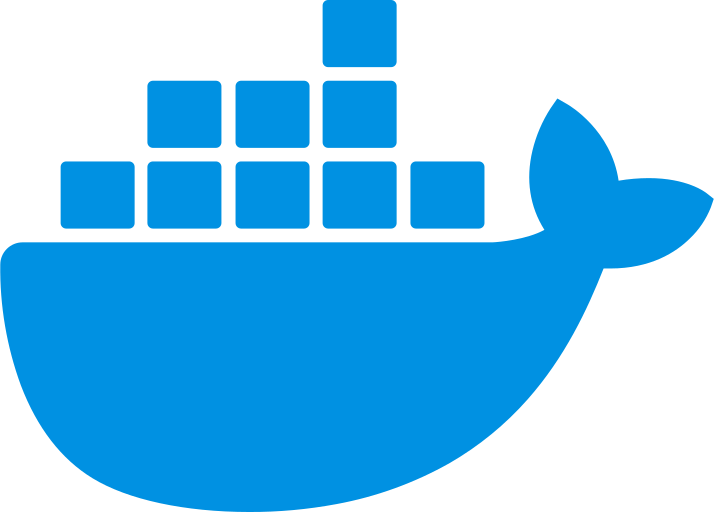

### Hi 👋

My name is Ivan Levchenko (aka Livan).

I'm a full stack developer.
I like to code in TypeScript, use GraphQL for communication, automate CI/CD with Docker & GitLab CI.

### Frontend stack

  &ensp;
  &ensp;
  &ensp;
  &ensp;
  &ensp;
  

### Backend stack

  &ensp;
  &ensp;
  &ensp;
  &ensp;
  &ensp;

### Other stuff

  &ensp;
  &ensp;
  &ensp;
  &ensp;
  &ensp;
  &ensp;
  &ensp;
  &ensp;
  &ensp;
  &ensp;
  &ensp;
  &ensp;
  &ensp;

